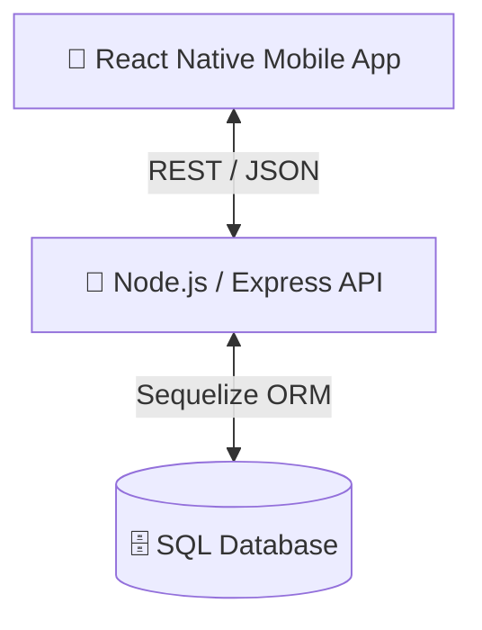

# La Grande Soirée Gnawa

<!-- 1. 🎯 HEADER -->
<div align="center">
  <h1>🪕 La Grande Soirée Gnawa</h1>
  <p><strong>Mobile Application for Gnawa Event Management and Booking</strong></p>
  
  []()
  []()
  []()
  []()
</div>

<!-- 2. 📑 TABLE OF CONTENTS -->
## 📑 Table of Contents
- [✨ Why this project?](#-why-this-project)
- [🎥 Demo](#-demo)
- [📋 Description](#-description)
- [🏗️ Architecture](#️-architecture)
- [📱 Features](#-features)
- [🗂️ Database](#️-database)
- [🔐 Security](#-security)
- [📡 API](#-api)
- [🚀 Deployment](#-deployment)
- [📦 Installation](#-installation)
- [🔧 Troubleshooting](#-troubleshooting)
- [🔄 Roadmap](#-roadmap)
- [👨‍💻 Team](#-team)
- [📄 License](#-license)
- [📞 Contact](#-contact)

<!-- 3. ✨ HOOK -->
## ✨ Why this project?
| Raison | Description |
|--------|-------------|
| **Culture** | Promoting the rich Moroccan Gnawa heritage through a modern digital platform. |
| **Efficiency** | Streamlining event management and artist bookings in one unified application. |
| **Experience** | Providing a seamless UI/UX for both users (attendees) and admins (organizers). |

**Key Stats:** Mobile (React Native) + Backend (Node.js) \| Full REST API \| Role-based Auth

<!-- 4. 🎥 DEMO -->
## 🎥 Demo
*(Add your GIF or Video link here)*
<br>
*(Add 4-6 screenshots grid of the mobile application here)*

<!-- 5. 📋 DESCRIPTION -->
## 📋 Description
**La Grande Soirée Gnawa** is a comprehensive mobile application designed to manage and promote a major Gnawa cultural event. 
- **Objectifs:** Digitalize artist discovery, facilitate secure bookings, and provide event information to attendees.
- **Public Cible:** Gnawa music fans, cultural event attendees, and event organizers.

<!-- 6. 🏗️ ARCHITECTURE -->
## 🏗️ Architecture

### System Diagram


### Folder Structure
```text
La-Grande-Soiree-Gnawa/
├── frontend/             # React Native Mobile App
│   ├── src/              # UI components, screens, navigation
│   ├── package.json      # Mobile dependencies
│   └── ...
└── backend/              # Node.js Express API
    ├── src/
    │   ├── config/       # DB configuration
    │   ├── controllers/  # API Logic
    │   ├── middlewares/  # Auth & Validation
    │   ├── models/       # Sequelize Models (Artist, Booking, EventInfo, Admin)
    │   ├── routes/       # Express Routes
    │   └── server.js     # Entry point
    ├── seeds/            # Initial DB data
    └── package.json      # Backend dependencies
```

### Tech Stack
- **Frontend:** React Native (0.82), React Navigation, Zustand, React Query, Axios, MMKV.
- **Backend:** Node.js, Express.js.
- **Database:** SQL (MySQL/PostgreSQL via Sequelize ORM).
- **Tooling:** PNPM Workspaces (Monorepo).

<!-- 7. 📱 FEATURES -->
## 📱 Features

**Pour les Utilisateurs (Attendees):**
- 📅 View event details and schedule.
- 🧑‍🎤 Browse Gnawa artists and their profiles (photos, descriptions).
- 🎟️ Book tickets/sessions with artists (generates a unique booking code).

**Pour les Administrateurs (Organizers):**
- 🔐 Secure Admin login.
- 📝 Manage Artists (Add, Edit, Delete).
- 📊 View and manage all bookings.

<!-- 8. 🗂️ Database -->
## 🗂️ Database

**Principales Tables:**
- **Artists:** `id`, `name`, `photo`, `description`
- **Bookings:** `id`, `Code` (unique), `customerName`, `customerEmail`, `artistId` (Foreign Key)
- **EventInfo:** Details about the event setup.
- **Admins:** Credentials for dashboard access.

<!-- 9. 🔐 SECURITY -->
## 🔐 Security
- ✅ **Mesures implémentées:**
  - Password Hashing with `bcrypt/bcryptjs`.
  - JWT (JSON Web Tokens) for secure Admin authentication.
  - CORS configured for API protection.
- 🔄 **À implémenter:** Rate limiting, Input sanitization.

<!-- 10. 📡 API -->
## 📡 API
Principaux Endpoints REST (Base URL: `/api`):
- `GET /eventinfo` - Obtenir les informations de l'événement.
- `GET /artist` - Lister les artistes.
- `POST /bookings` - Créer une nouvelle réservation.
- `POST /auth/login` - Authentification administrateur.
- `CRUD /admin/artists` - Gestion des artistes (protégé).

<!-- 11. 🚀 DEPLOYMENT -->
## 🚀 Deployment
- **Backend:** Prêt à être déployé sur Render, Heroku, ou VPS (utilise `process.env.PORT`).
- **Frontend:** Scripts disponibles pour build Android (`pnpm android`) et iOS.

<!-- 12. 📦 INSTALLATION -->
## 📦 Installation

**Prérequis:** Node.js (>=20), PNPM, React Native environment setup.

```bash
# 1. Cloner le repo
git clone <url-du-repo>
cd La-Grande-Soiree-Gnawa

# 2. Installer les dépendances (Monorepo)
pnpm install

# 3. Configurer l'environnement
# Créer un fichier .env dans backend/ avec vos variables de DB
cd backend
cp .env.example .env # (Configurez votre DB et JWT_SECRET)

# 4. Lancer le backend
cd ..
pnpm backend

# 5. Lancer l'application mobile
pnpm mobile # Démarre le bundler Metro
pnpm android # Pour lancer sur émulateur Android
```

<!-- 13. 🔧 TROUBLESHOOTING -->
## 🔧 Troubleshooting
- **Problème Metro Bundler:** Si le bundler React Native freeze, lancez `pnpm start --reset-cache` dans le dossier frontend.
- **Erreur Base de données:** Vérifiez que votre serveur SQL tourne et que les credentials dans `backend/.env` sont corrects. L'ORM Sequelize créera les tables automatiquement au démarrage.

<!-- 14. 🔄 ROADMAP -->
## 🔄 Roadmap
- [ ] Push Notifications for booking confirmations.
- [ ] Multilingual support (Arabic/French/English).
- [ ] Online Payment gateway integration.

<!-- 15. 👨‍💻 TEAM -->
## 👨‍💻 Team
| Nom | Rôle | Liens |
|-----|------|-------|
| **[Your Name]** | Full Stack Developer | [GitHub](#) \| [LinkedIn](#) |

<!-- 16. 📄 LICENSE -->
## 📄 License
This project is licensed under the **ISC License**.

<!-- 17. 📞 CONTACT -->
## 📞 Contact
| Type | Lien / Email |
|------|--------------|
| **Email Pro** | your.email@example.com |
| **Bug Reports** | [Ouvrir une Issue](#) |

*Pour signaler un bug, merci d'ouvrir une issue sur GitHub avec les étapes pour le reproduire.*

<!-- 18. 📝 CHANGELOG -->
## 📝 Changelog
- **Version 1.0.0:** Initial release with core features (Artist browsing, Bookings, Admin Dashboard).

<!-- 19. ❤️ FOOTER -->
<div align="center">
  <p>Made with ❤️ in Morocco.</p>
</div>
